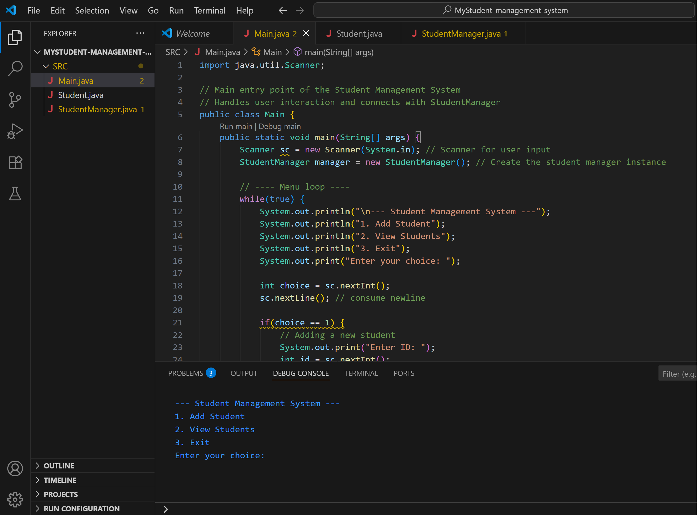
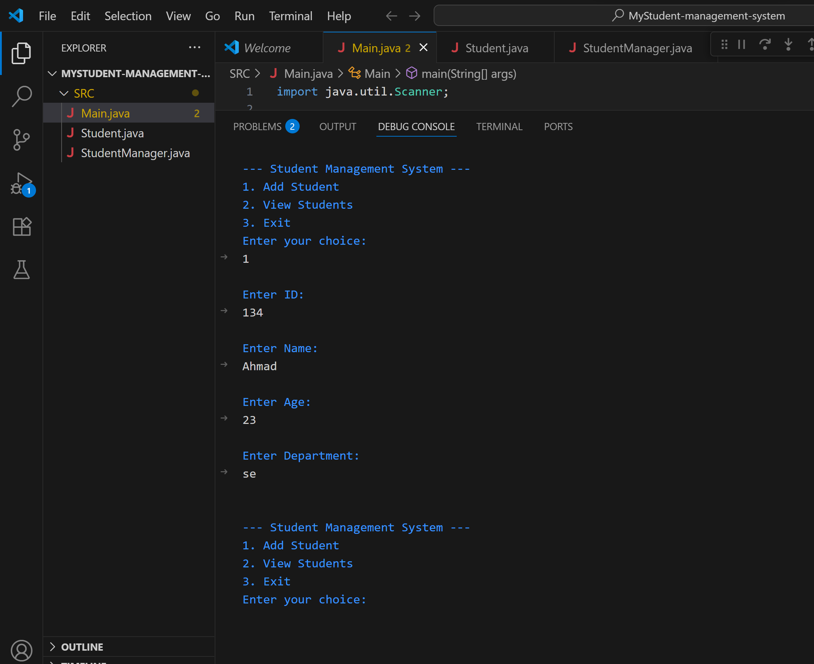
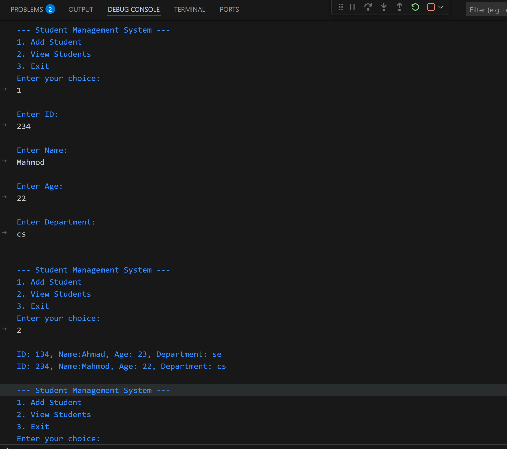
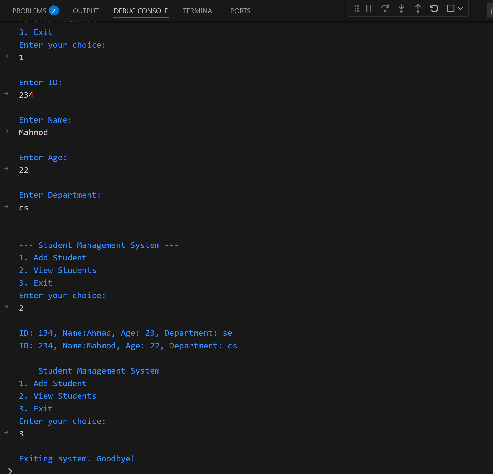

📘 Student Management System (Java)

A console-based Java application designed to manage student records.
This project was built to practice core Java concepts, object-oriented programming, and basic user interaction through the terminal.

⚙️ Features

Add new students
View all stored students
Simple menu-driven interface
Data stored in memory during runtime

▶️ How to Run the Project

Requirements

Java JDK 8 or higher
VS Code (or any Java-supported IDE)
Steps
Open the project folder in VS Code
Navigate to src/Main.java
Click the Run ▶️ button in VS Code
(or right-click → Run Java)
The program will start in the terminal.

🧪 Sample Output

=== Student Management System ===
1. Add Student
2. View Students
3. Exit
Enter your choice: 1

Enter ID: 1
Enter Name: Ali
Enter Age: 20
Enter Department: Computer Science
Student added successfully!

🖼️ Screenshots

### Main Menu

### Add Student

### View Students

### Exit Program

📚 Learning Outcomes

Through this project, I practiced and improved:
Java class design and object-oriented principles
Working with ArrayList for data storage
Using Scanner for user input
Separating logic into multiple classes
Writing readable and structured code

🚧 Project Status

Completed (Basic Version)
Possible future improvements:
File-based data storage
Update and delete student records
Input validation
GUI version using JavaFX

👤 Author

Sturai Nesar
Software Engineering Student
University of the People
GitHub: https://github.com/SturaiNesar 

📝 Notes

This project is part of my learning journey in Java and software development.
The goal is clarity, correctness, and gradual improvement rather than complexity.
